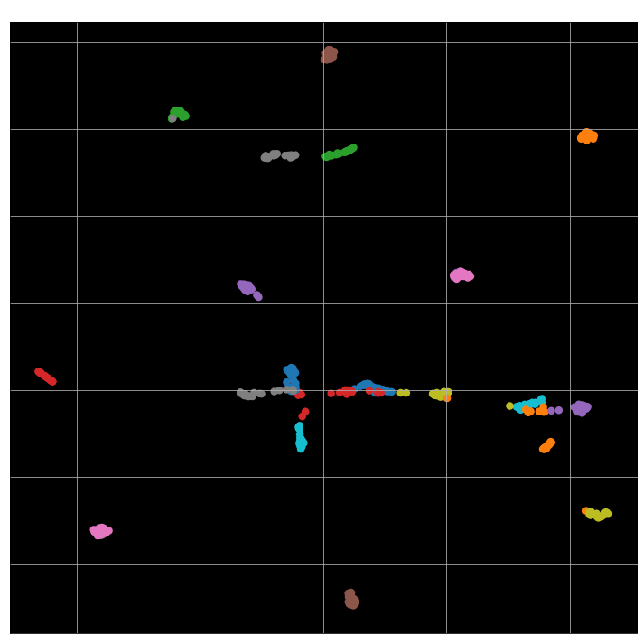
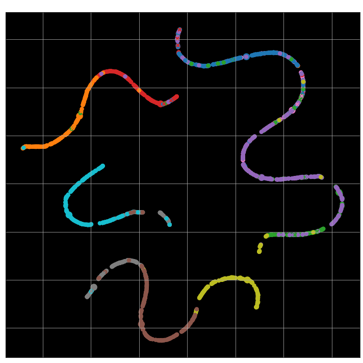

# :yum: Siamese network

Check the [CHANGELOG](https://github.com/yui-mhcp/yui-mhcp/blob/main/CHANGELOG.md) file to have a global overview of the latest modifications ! :yum:

## Project structure

```bash
├── custom_architectures
│   ├── transformers_arch
│   │   ├── clip_text_encoder_arch.py   : CLIP text encoder architecture (GPT-2 like)
│   │   └── visual_transformer_arch.py  : CLIP image encoder architecture
│   ├── clip_arch.py
│   └── modified_resnet_arch.py     : CLIP image encoder architecture (ResNet based)
├── custom_layers
├── custom_train_objects
│   ├── generators
│   │   ├── audio_siamese_generator.py  : siamese generator for audio data
│   │   ├── image_siamese_generator.py  : siamese generator for image data
│   │   └── siamese_generator.py        : abstract siamese data generator
├── datasets
├── hparams
├── loggers
├── models
│   ├── siamese
│   │   ├── audio_encoder.py    : audio encoder class (audio to audio comparison with GE2E loss)
│   │   ├── audio_siamese.py    : audio siamese class (audio to audio comparison)
│   │   ├── base_comparator.py  : abstract Comparator class
│   │   ├── base_encoder.py     : abstract Encoder class
│   │   ├── clip.py             : CLIP main class (experimental) (text to image comparison)
│   │   ├── image_siamese.py    : image siamese class (image to image comparison)
│   │   ├── siamese_network.py  : abstract Siamese class
│   │   └── text_siamese.py     : text siamese class (text to text comparison)
├── pretrained_models
├── unitest
├── utils
├── example_audio_siamese.ipynb
├── example_clip.ipynb
├── example_fashion_mnist_siamese.ipynb
├── example_fashion_mnist_siamese_2.ipynb
├── example_mnist_siamese.ipynb
└── example_text_siamese.ipynb
```

Check [the main project](https://github.com/yui-mhcp/base_dl_project) for more information about the unextended modules / structure / main classes. 

Note : CLIP is a newly added model and is still experimental. It is properly working in the notebook but I have not tested to train it yet. 

## Available models

| Input types   | Dataset   | Architecture  | Embedding dim | Trainer   | Weights   |
| :-----------: | :-------: | :-----------: | :-----------: | :-------: | :-------: |
| mel-spectrogram   | [LibriSpeech](http://www.openslr.org/12)  | `AudioSiamese (CNN 1D + LSTM)`   | 256   | [me](https://github.com/yui-mhcp) | [Google Drive](https://drive.google.com/file/d/1-WWfmQs7pGRQpcZPI6mn9c4FTWnrHZem/view?usp=sharing)  |
| mel-spectrogram   | [VoxForge](http://www.voxforge.org/), [CommonVoice](https://commonvoice.mozilla.org/fr/datasets) | `AudioEncoder (CNN 1D + LSTM)`   | 256   | [me](https://github.com/yui-mhcp) | [Google Drive](https://drive.google.com/file/d/1bzj9412l0Zje3zLaaqGOBNaQRBYLVO2q/view?usp=share_link)  |
| text (tokens) | [SNLI](https://nlp.stanford.edu/projects/snli/)  | `TextSiamese (BERT + Bi-LSTM)`   | 512   | [me](https://github.com/yui-mhcp) | [Google Drive](https://drive.google.com/file/d/17s2PTlI33C23pEvucK0dagCINEW7g0DH/view?usp=sharing)  |
| 10-digit  | `MNIST`   | `ImageSiamese`    | [me](https://github.com/yui-mhcp) | [Google Drive](https://drive.google.com/file/d/1NaArsbICsb8lvPuOLKgw_fOHPKsU3YBC/view?usp=sharing)  |
| 10        | `Fashion MNIST`   | `ImageSiamese`    | 64    | [me](https://github.com/yui-mhcp) | [Google Drive](https://drive.google.com/file/d/13V9uKj-6U2jZDN9w-tSIl64ACybZwVZ2/view?usp=sharing)  |
| 10        | `Fashion MNIST`   | `ImageSiamese`    | 64    | [me](https://github.com/yui-mhcp) | [Google Drive](https://drive.google.com/file/d/1CqY-CrsWCkKNqYuewFe2t9leWb3QSDfQ/view?usp=sharing)  |

Models must be unzipped in the `pretrained_models/` directory !

Note : for [CLIP](https://openai.com/blog/clip/) models, weights are automatically downloaded from  [the original project](https://github.com/openai/clip). They require `pytorch` to be installed but you do not need a working GPU installation. 

## Installation and usage

1. Clone this repository : `git clone https://github.com/yui-mhcp/siamese_networks.git`
2. Go to the root of this repository : `cd siamese_networks`
3. Install requirements : `pip install -r requirements.txt`
4. Open an example notebook and follow the instructions !

## TO-DO list :

- [x] Make the TO-DO list
- [x] Comment the code
- [x] Optimize `KNN` in pure `tensorflow`
- [x] Implement the `clustering` procedure
- [ ] Implement the `similarity matrix` evaluation procedure
- [ ] Implement the `clustering` evaluation procedure
- [x] Add the `AudioSiamese` model
- [ ] Make the `Siamese` class a sublcass of `Comparator` (as siamese networks are a special case of Comparator networks where the 2 encoders refer to the same model)
- [x] Add more configuration for `AudioSiamese `audio processing
- [x] Improve the image loading support
- [x] Improve siamese datasets creation performances (quite slow if you use many combinations / id but more efficient for many different ids with *small* items (typically around 100 / id))
- [ ] Implement more comparators :
    - [x] Audio - Audio comparator (`AudioSiamese`)
    - [x] Image - Image comparator (`ImageSiamese`)
    - [x] Text - Text comparator (`TextSiamese`)
    - [x] Text - Image comparator ([CLIP](https://openai.com/blog/clip/))
    - [ ] Text - Video comparator
- [x] Implement a `Siamese`-like model supporting the `GE2E` loss
    - [x] Implement a `data generator` that generates *N* items from the same *ID* consecutively (required by the GE2E loss)
    - [x] Implement a `BaseEncoder` class that is a simple `Encoder` model (in progress)
    - [x] Implement an `AudioEncoder` model and share pretrained models / example codes
    - [ ] Implement an `ImageEncoder` model and share pretrained models / example codes

## What is Siamese Network ?

### Siamese architecture

The `siamese network` is a special type of architecture where the objective is to determine a similarity score between 2 inputs. 


Source : [this siamese network tutorial for animal recognition](https://miro.medium.com/max/1750/0*eeyjKVZFBdFjFQoK.png)

The Siamese network forward pass : 
- First, the 2 inputs are passed through the same neural network (CNN, perceptron, ...) which produces 2 *embedding* : a N-D vector representation of the input \*
- The 2 embeddings are passed through a distance function (L1, euclidian, ...) that gives the distance between the 2 embeddings
- Finally, the distance score is passed to a 1-neuron `Dense` layer with a `sigmoid` activation : it gives a kind of `probability score` that both inputs belongs to the same class

Note that the last step is quite optional, many tutorials you can find will not use this final layer and optimize the network by minimizing the distance-score for *same-inputs* pairs and maximize the distance for inputs pairs of different classes. 

However, I prefer this approach because it allows some interesting features : 
- It gives a probabilistic decision to decide if both inputs belongs to the same class or not (which is not the case if you just have a distance score). 
- It allows to simply train the model with the `binary_crossentropy_loss` and evaluate it with classical metrics such as `binary_accuracy` (while other method needs the `AUC` and `EER` because we do not have a fixed threshold)
- It allows to use the model as a classification model more easily than the other method

\* Note : after the `shared encoder` model, a `L2-normalization layer` seems to be really efficient to stabilize the model and improve performances

### Difference between a `Siamese` network and a `Comparator` network

A `Comparator` network is the general `Siamese` case where both encoders are different. Therefore, `Siamese Networks` are a special case of `Comparator` networks where both models are the same and share their weights. 

Example : 
- [Dense Passage Retrieval (DPR)](https://arxiv.org/abs/2004.04906) is a comparator network even if its 2 encoders are the same architecture, simply because their weights are different. 
- [CLIP](https://openai.com/blog/clip/) is by design a comparator network as its 2 inputs are different (image and text) so the 2 encoders are different.
- `AudioSiamese` is a siamese network because it only has 1 encoder that encodes the 2 input audios. 
    

### Advantages compared to a classical classifier

The most important advantage is that the `siamese architecture` can predict similarity between unseen classes !

When you want to add a new class label to a `classifier`, you need to retrain it from scratch (or use *transfer-learning* to speed up training) but you have to retrain your model

Because `siameses` compare inputs and determine similarity based on their embeddings, **you do not need** to retrain your model ! \*

\* Note that the performances of this `super-generalization` is really efficient only when the training set is large enough. 
- For the `Fashion MNIST` problem, results are quite poor because there are only 10 classes.
- However for the `AudioSiamese` trained on more than 900 speakers and evaluated on more than 200 (totally new) speakers, the train and test accuracy are nearly the same even though the model **never** saw any of the validation speakers !

Additional proof : a siamese model trained on `LibriSpeech` (english dataset) can be used with similar performances on `VoxForge` or `CommonVoice` (french datasets) !

This second performance is really impressive and can leads to really powerful and funny applications !

### What the model *thinks*

This is a really funny feature of `siamese networks` (even if this is also possible with `classifier` !) : the ability to see what the model thinks\* !


As shown above, the `siamese network` produces embedded version of inputs and compare them to decide whether the 2 embeddings are close enough to be considered as similar class. The idea is to plot these embeddings\*\* !

**Legend** : for the 2 images, circles represent an input data (image / audio) and colors represent labels. The objective is therefore to have a clear separation between clusters of colors

Here is the example from [the audio_siamese notebook](example_audio_siamese.jpynb) made on the validation set\*\*\*.



This second image comes from the [fashion MNIST example](example_fashion_mnist.jpynb) during its training (the model did not converge yet (around 75% accuracy)). However I stopped its training because I found the picture too funny / artistic :smile:




\* I call it this way but it is actually more *how the model represents data* :smile:

\*\* This is obviously not possible to represent a 64-D vector :zany_face: but we can use the [umap](https://pypi.org/project/umap-learn/) library to create 2D projection of these embeddings

\*\*\* Reminder : in the `AudioSiamese` example, the `validation set` is composend of **new** speakers. It means the model **never** saw these speakers in its `training set` : it shows the core power of `siamese networks` to generalize to unseen labels !

## How to predict with Siamese Networks

The prediction depends on *what* we want to predict : 
- Predict similarity / disimilarity between 2 inputs
- Define clusters in many inputs
- Predict the label of an input

### Predict similarity

This prediction is quite straightforward because it is the objectie of this architecture : give a similarity score between 2 inputs. 

Therefore, we just have to pass the 2 inputs through the network and get the result of the  final`Dense` layer

### Define clusters in multiple inputs

The objective is to have a set of inputs and try to determine clusters : subsets of data belonging to the same class

For this purpose, we can use different techniques but the one I choose is the following procedure : 
1. Compute the `similarity matrix` : the score of similarity between each pairs of inputs
2. Give the label 0 to the 1st embedding and -1 to all others
3. For embedding `i`, compute its similarity score between the `centroid` of all defined labels. 
4. Define `possible_ids` as the set of labels where the similarity with the centroid is higher than a threshold
    1. If the set of `possible_ids` is empty : create a new label for the `i th` embedding
    2. Otherwise, determine the label based on the `knn` decision rule with all points from `possible ids`

### Predict the label of an input

For this purpose we need to have a collection of labelled data in order to determine which of those labels is the most probable for this new input\*

For this purpose I designed a custom `KNN` algorithm which can take into account the predictions of the model (probability of similarity / disimilarity) and adjust its decision. Even more funny : it can says that the input belongs to an unseen label\*\* !

\* We could think that this initial collection of data is a drawback compared to a classic classifier which directly predicts the class label without *a-priori* datas. However it is a wrong intuition for 2 major reasons : 
1. The classifier also needs these *a-priori* data but during its training phase. The difference is that we do not need to save them as *memory* to the model for later prediction
2. The classifier is limited to the *a-priori* data used for training but the siamese model can have as *a-priori* data new labels

\*\* This feature is currently implemented directly inside the `SiameseNetwork` class and not in the `KNN`

## How to evaluate Siamese Networks (and Encoder networks in general)

### Training evaluation

The training loss is the `binary_crossentropy_loss` so I basically couple it with `binary_accuracy`, `AUC` and `EER` metrics

These metrics evaluate the ability of the model to correctly determine if the 2 inputs belong to the same class

However this is done only on the training / validation pairs but **do not** represents **all** possible combinations of those datas !

### Similarity matrix evaluation

The idea is the same as the `training evaluation` but here we will compute the metrics on **all** possible combinations of data

In order to avoid unnecessary computation, we will first compute all embeddings and then compute the distance between each possible pairs (note that the distance between i and j is the same as the distance between j and i : the matrix is symmetric)

Note : this evaluation procedure is not yet implemented. Furthermore, as during training we take a large amount of combinations, I suggest the results will not be really different. 

### Classification evaluation

The idea is to evaluate the model as if it was a classic `classifier`. 

This categorical accuracy is quite easy to compute : we call the `recognize()` function (as in the `predict input label` procedure) and see if it is thecorrect one or not. 

As we can see in the `example_mnist_classifier` notebook (`evaluation` section), the sample_size of given data and the `k` **do not** really impact the accuracy (less than 1%)

Another interesting point is that the `classification accuracy` is not so different compared to the `binary accuracy` in training. However this property is **not** generalizable because it is not the case in the `fashion_mnist` example

## Advanced usages of Siamese Networks (and Encoder networks)

As we have seen above, `siamese networks` can be used for **classification**, **clustering** \* and **similarity** scoring. 

However these features can be used in more advanced usage and the [from speaker verification to Text-To-Speech (SV2TTS)](https://papers.nips.cc/paper/2018/file/6832a7b24bc06775d02b7406880b93fc-Paper.pdf) paper is the perfect example of usage !

The idea is to use embeddings computed by a `speaker verification` model to pass it as input to a `Tacotron-2` architecture in order to create a multi-speaker `Text-To-Speech (TTS)` synthesis

In the article they use a 3-layer `LSTM` trained with the `Generalized End-To-End (GE2E) loss`  **but** I tried to copy the paper by replacing this `speaker encoder` by the `AudioSiamese` implementation and it worked quite good ! 

Indeed, `siamese networks` learn to associate similar data and augment the distance for different data. This idea can be really useful for many applications such as `speaker verification`, `text analysis`, `sentence meanings comparison`, ... 


\* The clustering procedure is done by the `KNN` but the `siamese` helps to determine decision boundaries to separate different clusters with the `similarity score` instead of using thresholds on distance. Furthermore, the `siamese networks` creates `embeddings` used by `knn`:smile:

## Contacts and licence

You can contact [me](https://github.com/yui-mhcp) at yui-mhcp@tutanota.com or on [discord](https://discord.com) at `yui#0732`

The objective of these projects is to facilitate the development and deployment of useful application using Deep Learning for solving real-world problems and helping people. 
For this purpose, all the code is under the [Affero GPL (AGPL) v3 licence](LICENCE)

All my projects are "free software", meaning that you can use, modify, deploy and distribute them on a free basis, in compliance with the Licence. They are not in the public domain and are copyrighted, there exist some conditions on the distribution but their objective is to make sure that everyone is able to use and share any modified version of these projects. 

Furthermore, if you want to use any project in a closed-source project, or in a commercial project, you will need to obtain another Licence. Please contact me for more information. 

For my protection, it is important to note that all projects are available on an "As Is" basis, without any warranties or conditions of any kind, either explicit or implied. However, do not hesitate to report issues on the repository's project or make a Pull Request to solve it :smile: 

If you use this project in your work, please add this citation to give it more visibility ! :yum:

```
@misc{yui-mhcp
    author  = {yui},
    title   = {A Deep Learning projects centralization},
    year    = {2021},
    publisher   = {GitHub},
    howpublished    = {\url{https://github.com/yui-mhcp}}
}
```

## Notes and references

Tutorials : 
- [1] [Medium tutorial for animal recognition](https://miro.medium.com/max/1750/0*eeyjKVZFBdFjFQoK.png) : source of the introduction image. The tutorial seems to be clear, complete with a practical approach. 
- [2] [Medium tutorial for speaker verification with siamese networks](https://medium.com/analytics-vidhya/building-a-speaker-identification-system-from-scratch-with-deep-learning-f4c4aa558a56) : the 1st tutorial I read on siamese networks. Its architecture was a 1st base model I improved. Clear, practical and with an interesting comparison between a classical classifier and a siamese-based approach. 
- [3] [Google GE2E Loss tutorial](https://google.github.io/speaker-id/publications/GE2E/) : amazing Google tutorial explaining the benefits of the GE2E loss compared to the Siamese approach (which they call the `Tuple End-to-End (TE2E) loss`)

Github project : 
- [voicemap project](https://github.com/oscarknagg/voicemap) : github associated with the 2nd tutorial and my 1st inspiration for the `AudioSiamese` model
- [OpenAI's CLIP](https://github.com/openai/clip) : the official `CLIP` implementation in pytorch. 
